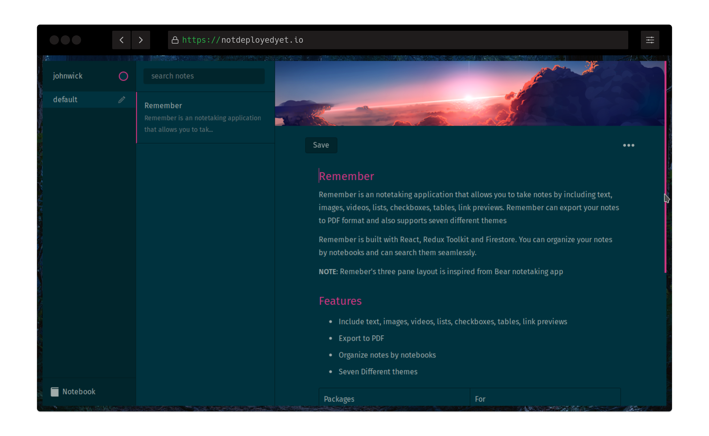
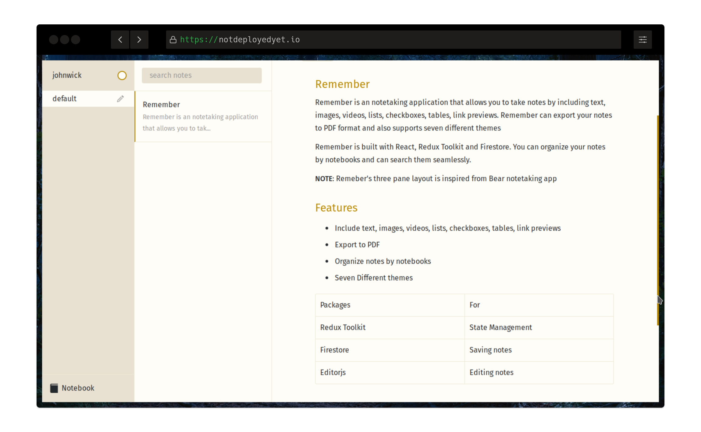
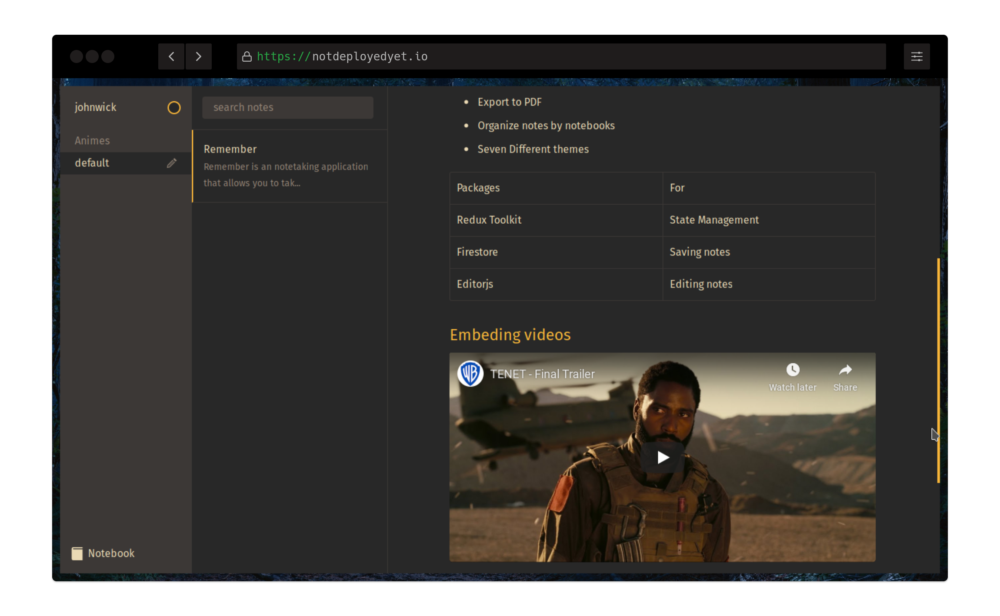
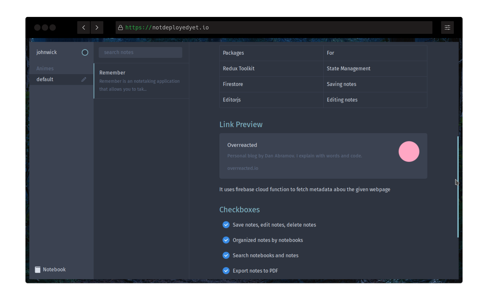

# Remember

Remember is an notetaking application that allows you to take notes by including text, images, videos, links, lists, checkboxes and support for code snippets, file attachments can be expected in the near future.

Remember is built with React, Redux Toolkit and Firebase. Remeber uses firestore to store the user notes and it uses Editor.js library for editing the notes.

Remember uses three pane layout to organize, edit and save your notes. This layout is borrowed from [Bear](https://bear.app) notetaking app

<a href="https://www.buymeacoffee.com/manikandanraji" target="_blank"></a>

## Core Dependencies

| Package               | For              |
| --------------------- | ---------------- |
| Redux Toolkit         | State Management |
| Firebase              | Firebase SDK     |
| Editor.js and Plugins | Editing notes    |

## Features

- Include text, images, videos, links, lists, checkboxes
- Organize notes by notebooks
- Search notes
- Export to PDF
- Seven different themes

## Running locally

1. You need to setup a firebase project and enable 'Authentication' and 'Cloud Firestore' support
2. Once done, you need to setup .env file at the root of this repository

```bash
# https://api.cloudinary.com/v1_1/CLOUD_NAME/image/upload
REACT_APP_UPLOAD_IMAGE_URL=[x]

# firebase cloud funtion http endpoint for link preview
REACT_APP_LINK_PREVIEW=[x]

# firebase config
REACT_APP_API_KEY=[x]
REACT_APP_AUTH_DOMAIN=[x]
REACT_APP_DATABASE_URL=[x]
REACT_APP_PROJECT_ID=[x]
REACT_APP_STORAGE_BUCKET=[x]
REACT_APP_MESSAGING_SENDER_ID=[x]
REACT_APP_APP_ID=[x]
REACT_APP_MEASUREMENT_ID=[x]
```

3. Then run <code>npm i && npm start</code>

## Watch the Demo

[](https://www.youtube.com/watch?v=LOxviFtsTOU "Remember Demo")

## Screenshots

### Editor (Solarized Dark)


### Editor (Gruvbox Dark)



### YT Video Embed (Gruvbox)



### Link Previews and Checkboxes (Nord)



## TODO

1. Support for code snippets, quote, file attachments
2. Export options: HTML, Markdown
